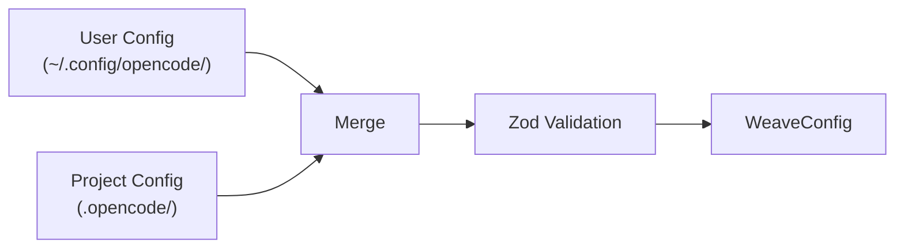
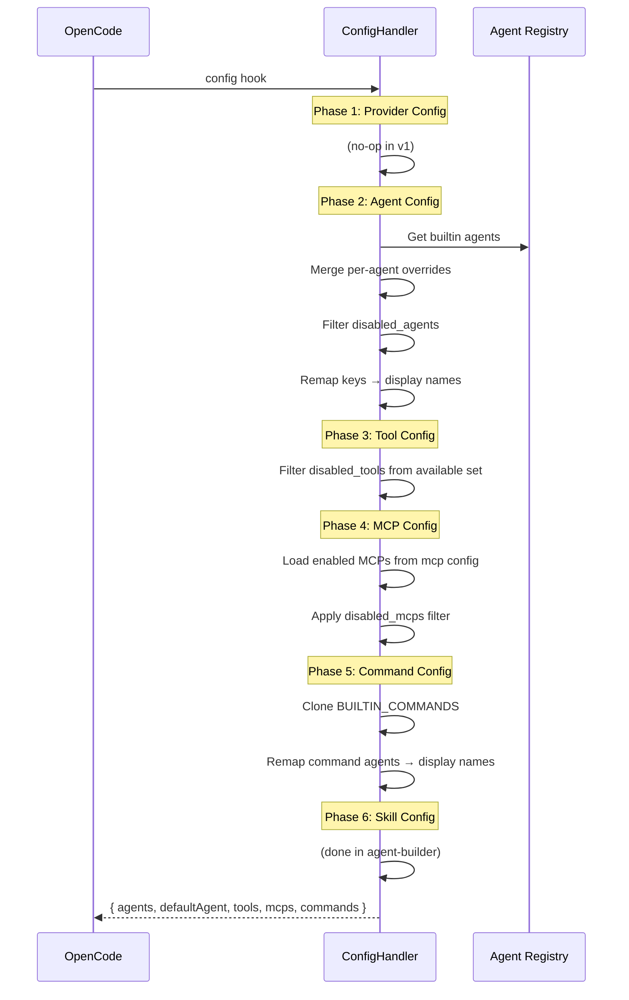
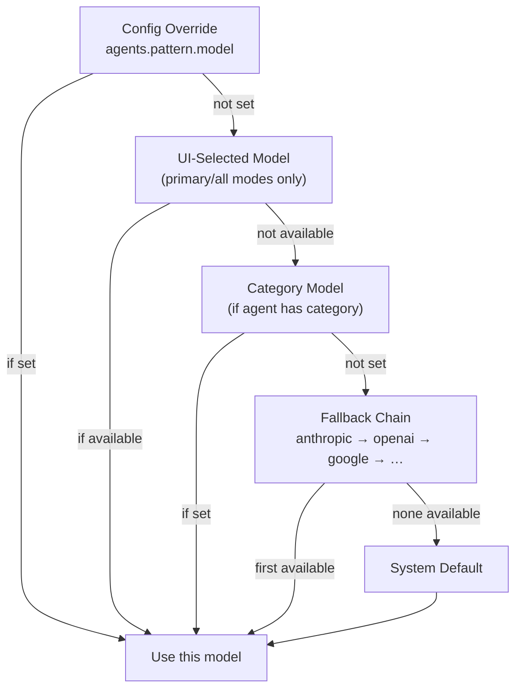

# Configuration Reference

Weave supports layered configuration through JSONC or JSON files at two levels.

## Config File Locations

| Level | Path | Priority |
|-------|------|----------|
| **Project** | `.opencode/weave-opencode.jsonc` (or `.json`) | Highest (overrides user) |
| **User** | `~/.config/opencode/weave-opencode.jsonc` (or `.json`) | Lowest (defaults) |

## Merge Strategy



- **Nested objects** (agents, categories): deep merge — project keys override user keys recursively
- **Arrays** (disabled_*): union with deduplication — both sets combined
- **Scalars**: project value wins over user value

## Full Schema

```jsonc
{
  // Per-agent overrides
  "agents": {
    "<agent-name>": {
      "model": "provider/model-name",      // Override model
      "temperature": 0.5,                   // 0-2
      "variant": "custom-variant-name",     // Prompt variant
      "skills": ["skill-1", "skill-2"],     // Inject skills
      "prompt_append": "Extra instructions", // Append to prompt
      "display_name": "My Agent Name",      // Custom name shown in UI
      "mcps": ["websearch", "grep_app"],    // MCP servers for this agent
      "tools": {                            // Per-tool toggles
        "bash": true,
        "write": false
      },
      "disable": false                      // Remove agent entirely
    }
  },

  // Domain-optimized model groups
  "categories": {
    "<category-name>": {
      "description": "What this category does",
      "model": "provider/model-name",
      "temperature": 0.3,
      "variant": "category-variant",
      "tools": { "bash": true }
    }
  },

  // Disable specific lifecycle hooks
  "disabled_hooks": [
    "context-window-monitor",
    "keyword-detector"
  ],

  // Hide tools from all agents
  "disabled_tools": ["some-tool-name"],

  // Exclude agents from the UI
  "disabled_agents": ["spindle"],

  // Filter skill loading
  "disabled_skills": ["some-skill"],

  // Background task concurrency
  "background": {
    "defaultConcurrency": 3,
    "providerConcurrency": {
      "anthropic": 5,
      "openai": 3
    },
    "modelConcurrency": {
      "claude-sonnet-4-20250514": 10
    },
    "staleTimeoutMs": 60000
  },

  // Terminal multiplexing (stub)
  "tmux": {
    "enabled": false,
    "layout": "default"
  },

  // Skill discovery paths
  "skills": {
    "paths": ["./.custom-skills"],
    "recursive": true
  },

  // MCP Configuration
  "mcp": {
    "enabled": {
      "websearch": true,      // Enable websearch MCP (uses EXA remote server)
      "context7": true,       // Enable context7 MCP (remote)
      "grep_app": true        // Enable grep_app MCP (remote)
    },
    "servers": {              // Custom MCP servers
      "custom-server": {
        "type": "local",     // local (stdio) or remote (http)
        "command": ["npx", "-y", "my-mcp-server"],
        "environment": {},    // Optional environment variables
        "timeout": 60000      // Optional timeout in ms
      }
    }
  },

  // Disable specific MCPs (applied after defaults)
  "disabled_mcps": ["websearch"]
}
```

### Default MCP Assignments

Each agent has default MCP assignments based on its role:

| Agent | Mode | Default MCPs | Description |
|-------|------|-------------|-------------|
| `loom` | primary | websearch, context7, grep_app | All MCPs for orchestration |
| `tapestry` | primary | websearch, context7, grep_app | All MCPs for execution |
| `shuttle` | all | grep_app | Code search for specialist |
| `pattern` | subagent | websearch, context7, grep_app | All MCPs for planning |
| `thread` | subagent | grep_app | Code search for exploration |
| `spindle` | subagent | context7, grep_app | Docs + code for research |
| `weft` | subagent | websearch | Web search for review |
| `warp` | subagent | websearch, grep_app | Audit + code for security |

You can override these per-agent:

```jsonc
{
  "agents": {
    "loom": {
      "mcps": ["context7"]  // Only context7 for Loom
    }
  }
}
```

Or disable MCPs at the global level:

```jsonc
{
  "mcp": {
    "enabled": {
      "websearch": false,
      "context7": false,
      "grep_app": false
    }
  }
}
```

> **Note**: If you manually specify `tools` in agent config, MCP defaults won't be applied (to preserve your tool restrictions).
  "agents": {
    "thread": {
      "mcps": ["websearch", "grep_app"]  // Custom MCPs for this agent
    }
  },

  // Experimental features
  "experimental": {
    "plugin_load_timeout_ms": 5000,
    "context_window_warning_threshold": 0.8,
    "context_window_critical_threshold": 0.95
  }
}
```

## Agent Names

Valid agent names for the `agents` config key:

| Config Key | Mode | Display Name (Default) | Default Role |
|------------|------|----------------------|-------------|
| `loom` | primary | Loom (Main Orchestrator) | Primary orchestrator |
| `tapestry` | primary | Tapestry (Execution Orchestrator) | Plan executor |
| `shuttle` | all | shuttle | Category specialist |
| `pattern` | subagent | pattern | Strategic planner |
| `thread` | subagent | thread | Codebase explorer |
| `spindle` | subagent | spindle | External researcher |
| `weft` | subagent | weft | Reviewer/auditor |
| `warp` | subagent | warp | Security auditor |

> **Note**: Agent mode determines UI behavior:
> - **Primary** (`loom`, `tapestry`): Display name keys shown in UI (e.g., "Ra", "Anubis")
> - **All** (`shuttle`): Both canonical and display name keys (for Task tool + UI)
> - **Subagent** (`pattern`, `thread`, `spindle`, `weft`, `warp`): Canonical keys only (Task tool compatibility)

### Custom Display Names with Egyptian Names Example

You can override the display name shown in the OpenCode UI for any builtin agent using the `display_name` field. This is useful for Egyptian-themed names or project-specific aliases.

```jsonc
{
  "agents": {
    // Egyptian mythology names
    "loom": { "display_name": "Ra (Orchestrator)" },
    "tapestry": { "display_name": "Anubis (Executor)" },
    "shuttle": { "display_name": "Bastet (Specialist)" },
    "pattern": { "display_name": "Thoth (Planner)" },
    "thread": { "display_name": "Horus (Explorer)" },
    "spindle": { "display_name": "Seshat (Researcher)" },
    "weft": { "display_name": "Maat (Reviewer)" },
    "warp": { "display_name": "Sekhmet (Security)" }
  }
}
```

**How it works**:
- Config uses **canonical keys** (`loom`, `tapestry`, `shuttle`, etc.) — this ensures Task tool works
- `display_name` property sets the UI label (e.g., "Ra (Orchestrator)")
- Primary agents (`loom`, `tapestry`): Display name becomes the config key for UI
- Subagents (`thread`, `spindle`, etc.): Keep canonical keys (Task tool validation)
- Dual-mode agent (`shuttle`): Both canonical AND display name keys registered

**Notes**:
- The `display_name` only affects the UI label — all internal systems (workflows, `disabled_agents`, prompt references) continue to use the original config key (e.g., `"loom"`).
- Setting `display_name` on a disabled agent is safe and has no effect on the UI.
- Narration hints in Loom's system prompt use hardcoded names and will not reflect custom display names (known limitation).

## Config Pipeline (6 Phases)

When the plugin initializes, `ConfigHandler` transforms the merged config into OpenCode's expected format:



### Output Applied to OpenCode

```typescript
config.agent = result.agents           // Register all agent configs
config.command = result.commands       // Register /start-work
config.default_agent = result.defaultAgent // "Loom (Main Orchestrator)"
```

## Model Resolution

Each agent resolves its model through a priority chain:



### Per-Agent Fallback Chains

| Agent | Fallback Priority |
|-------|------------------|
| Loom | anthropic → openai → google |
| Tapestry | anthropic → openai → google |
| Pattern | anthropic → openai → google |
| Thread | anthropic → openai → google |
| Spindle | anthropic → openai → google |
| Weft | anthropic → openai → google |
| Warp | anthropic → openai → google |
| Shuttle | *(uses category model or default)* |

## Examples

### Override Pattern to use a different model

```jsonc
{
  "agents": {
    "pattern": {
      "model": "openai/gpt-5",
      "temperature": 0.5
    }
  }
}
```

### Set up domain categories

```jsonc
{
  "categories": {
    "backend": {
      "description": "Backend API development",
      "model": "anthropic/claude-opus-4",
      "temperature": 0.1
    },
    "frontend": {
      "description": "React/UI development",
      "model": "openai/gpt-5",
      "temperature": 0.3
    }
  }
}
```

### Disable agents and hooks

```jsonc
{
  "disabled_agents": ["spindle"],
  "disabled_hooks": ["context-window-monitor", "keyword-detector"],
  "disabled_tools": ["webfetch"]
}
```

### Custom skill paths

```jsonc
{
  "skills": {
    "paths": ["./.custom-skills", "../shared-skills"],
    "recursive": true
  },
  "agents": {
    "pattern": {
      "skills": ["planning-guidelines"]
    },
    "shuttle": {
      "skills": ["react-best-practices", "api-design"]
    }
  }
}
```

### Tune background concurrency

```jsonc
{
  "background": {
    "defaultConcurrency": 2,
    "providerConcurrency": {
      "anthropic": 5,
      "openai": 3
    },
    "staleTimeoutMs": 120000
  }
}
```
